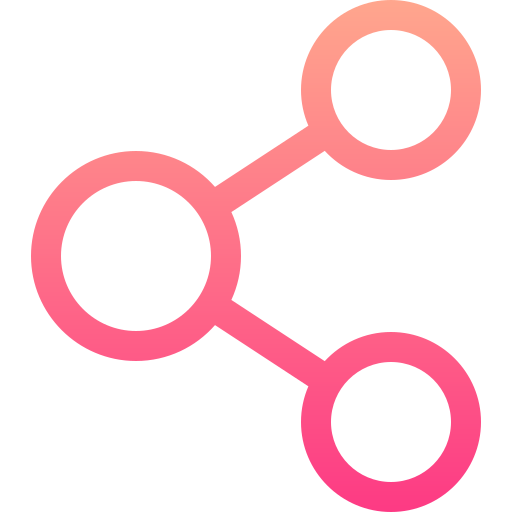
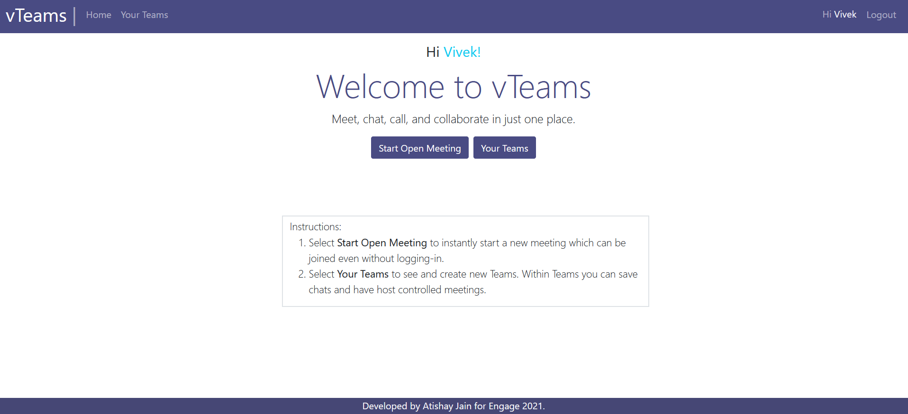
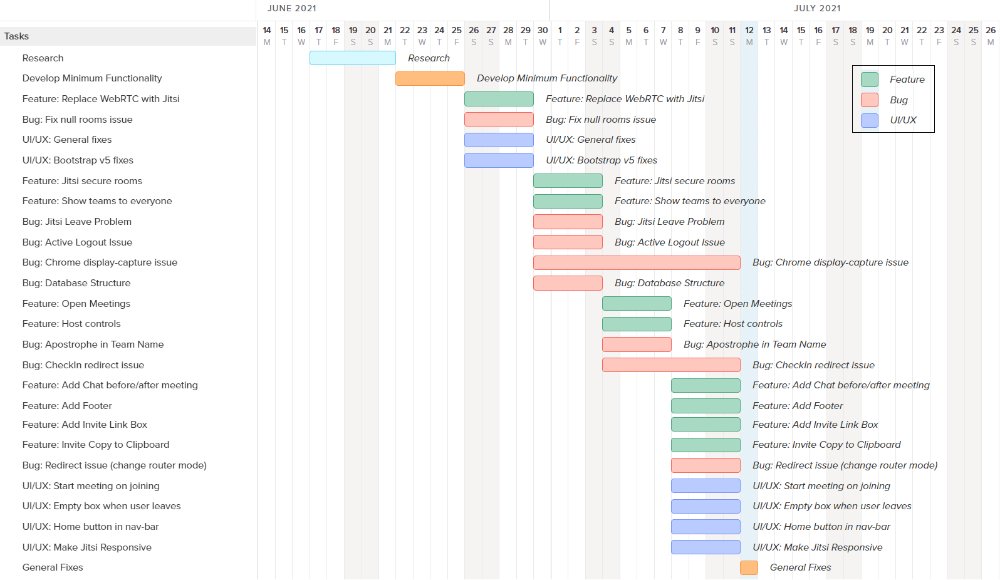

<!-- PROJECT LOGO -->
<br />
<p align="center">
  <a href="https://github.com/othneildrew/Best-README-Template">
    
    
  </a>

  <h3 align="center">Microsoft Engage 2021 Challenge</h3>

  <p align="center">
    A Microsoft Teams Clone with group video call and team channels!
    <br />
    <a href="">View Demo</a>
    ·
    <a href="https://teams-meet.netlify.app/">Live Site</a>
  </p>
</p>

<!-- TABLE OF CONTENTS -->
<details open="open">
  <summary>Table of Contents</summary>
  <ol>
    <li>
      <a href="#about-the-project">About The Project</a>
      <ul>
        <li><a href="#overview">Overview</a></li>
        <li><a href="#features">Features</a></li>
        <li><a href="#frameworks-and-services">Frameworks and Services</a></li>
        <li><a href="#work-methodology">Work Methodology</a></li>
      </ul>
    </li>
    <li>
      <a href="#getting-started">Getting Started</a>
      <ul>
        <li><a href="#prerequisites">Prerequisites</a></li>
        <li><a href="#installation">Installation</a></li>
      </ul>
    </li>
    <li><a href="#database-structure">Database Structure</a></li>
    <li><a href="#screenshots">Screenshots</a></li>
    <li><a href="#tips-for-developers">Tips for Developers</a></li>
    <li><a href="#known-issues-and-limitations">Known Issues and Limitations</a></li>
    <li><a href="#contact">Contact</a></li>
    <li><a href="#acknowledgements">Acknowledgements</a></li>
  </ol>
</details>

<!-- ABOUT THE PROJECT -->

## About The Project

<!--
[![Product Name Screen Shot][product-screenshot]](https://example.com) -->

<figure  align="center">
  
  <!-- <figcaption style="text-align: center">Home Page</figcaption> -->
</figure>

### Overview

This is a group video call and basic team management web application developed with Vue.js and Firebase. This project is developed as a part of [Microsoft Engage 2021](https://microsoft.acehacker.com/engage2021/) - an Engagement and Mentorship Program by Microsoft in association with [AceHacker](https://www.acehacker.com/).

The focus of Engage 2021 was on Agile Development Methodology, a work framework that helps in adapting to uncertainties and emphasizes teamwork. Since this program demanded individual participation, selected individual-level agile practices were chosen and adopted in the development of this project.

### Features

Some of the major features of the app include:

- Group Video Call
- User Authentication
- Responsive App
- Join Open Meetings without Login
- Dedicated channels/rooms for teams
- Chats saved permanently in your team room
- Host Controlled Meetings
- Room CheckIns and Waiting Room
- Powerful Jitsi Calls
  - Turn on/off Camera, Mute Mic and Screen share
  - Raise Hands
  - Send messages personally
  - Full Screen support

Other minor features include:

- Navigation Bar
- Invite Link
- Copy to Clipboard for invite
- Instruction Box
- Ability to change user name in meetings and team rooms.
- Tooltips wherever needed

### Frameworks and Services

Major Frameworks and Services used in this project:

- [Vue.js](https://vuejs.org/)
- [Firebase](https://firebase.google.com/)
- [Jitsi](https://jitsi.org/)
- [Bootstrap](https://getbootstrap.com)

### Work Methodology

This project is developed using **Agile Development Methodology** with a **Design Thinking** approach to test features and prototypes.

The work was organized in **4-day scrum sprints**. Tasks or backlogs for a sprint were bucketed in three categories:

1. Features
2. Bugs
3. UI/UX

If a backlog was not cleared in a sprint, it was rolled over to the subsequent sprint.

<figure  align="center">
  
  <figcaption style="text-align: center">Project Timeline</figcaption>
</figure>

After every sprint, the app was given to friends, colleagues and, family members for testing and feedback was taken. This practice of building prototypes very fast and getting user feedback is a standard design thinking practice. After receiving the feedbacks, the work was reviewed and the tasks for the next sprint were decided. One common observation from this activity is that majority of the people wanted the app to be **simpler** and **more intuitive**.

<!-- GETTING STARTED -->

## Getting Started

### Prerequisites

- Node.js and npm

  - Download the latest stable version of [Node.js](https://nodejs.org/).
  - If you already have Node.js, update npm

    ```sh
    npm install npm@latest -g
    ```

- Firebase
  - Create a [Firebase Account](https://firebase.google.com/).
  - Start a new project.
  - Enable user authentication via Email ([Reference](https://firebase.google.com/docs/auth/web/start))
  - Note SDK configuration code

### Installation

#### Project Setup

1. Clone the repo
   ```sh
   git clone https://github.com/atishayjn/TeamsWebsite.git
   ```
2. Install NPM packages

   ```sh
   npm install
   ```

3. Enter your Firebase SDK configuration code in `db.js` in place of environment variables
   ```JS
   let firebaseConfig = { 'ENTER YOUR SDK CONFIG' };
   ```

#### Compile and run for development

```
npm run serve
```

#### Compile and minify for production

```
npm run build
```

## Database Structure

The Firestore database is organized in a specific manner given below. You can start with an empty Firestore database and the app itself generates the data in the given manner.

#### Users collection

```javascript
users: {
  USER_ID: {
  }
}
```

#### Rooms collection inside a User document

```javascript
rooms: {
  ROOM_ID: {
    name: String,
    hostID: String,
    createdAt: Date
  }
}
```

#### Attendees collection inside a Room document

```javascript
attendees: {
  ATTENDEES_ID: {
    displayName: String,
    approved: Boolean,
    createdAt: Date
  }
}
```

#### Messages collection inside a Room document

```javascript
messages: {
  MESSAGES_ID: {
    author: String,
    author_id: String,
    message: String,
    createdAt: Date
  }
}
```

## Screenshots

## Tips for Developers

To understand the code, especially if you plan to build this app from scratch.

1. Start with Vue files with names starting with **App\***.
   - These files contain the base app level code.
2. After this you can follow one of the two ways:

   (i) To understand the minimum functional code (easy), check vue files with name starting with **Open\***.

   (ii) To explore and understand the main features of the app, check vue files with name starting with **Teams\***.

I highly recommended going through [Vue Style Guide]() to follow good coding practices.

<!-- KNOWN ISSUE AND LIMITATIONS -->

## Known issues and limitations

<!-- To do at the end -->

<!-- CONTACT -->

## Contact

Atishay Jain

[](https://github.com/atishayjn)
[](https://twitter.com/atishay_jn_)
[](https://www.linkedin.com/in/atishayjn)

<!-- ACKNOWLEDGEMENTS -->

## Acknowledgements

[VueMastery](vuemastery.com/) Introductory course on Vue.js, and Vue.js + Firebase Project Course by [Ray Villalobos](https://raybo.org/) on LinkedIn Learning had been of great help in the development of this project.

Special thanks to [Ishant Gupta](https://in.linkedin.com/in/ishantgupta777), [Ritik Taneja](https://in.linkedin.com/in/ritiktaneja) and [Avi Wadhwa](https://in.linkedin.com/in/avi-wadhwa-268756167) to recommend me the right resources and frameworks to get started with Web Development and help me in fixing bugs.
They have been as important to this project as [Stack Overflow](https://stackoverflow.com/).

[product-screenshot]: images/Home-page.png
